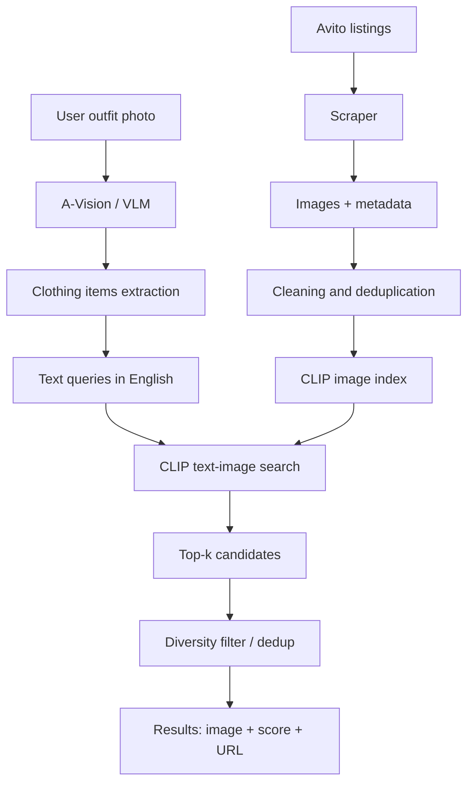

# Avito VLM Engine

<div align="center">


**Мультимодальный пайплайн для поиска похожей одежды на Avito: фото образа → распознавание вещей → CLIP-поиск по каталогу → top-k объявлений с изображениями и ссылками.**

[Google Colab](https://drive.google.com/file/d/1bCRxSZnwWRWddofKRIj2TMbe0r1uLNZ-/view?usp=sharing) · [Dataset](https://drive.google.com/drive/folders/1IiRcxM8HM6hAr6Z1VyFi2jkYGty91Hhn?usp=sharing)

</div>

---

## О проекте

**Avito VLM Engine** — проект на стыке компьютерного зрения, мультимодального поиска и прикладного ML.

Идея простая: пользователь загружает фотографию человека в одежде, система выделяет элементы образа, переводит их в текстовые fashion-запросы и ищет похожие товары в локальном каталоге изображений, собранном с Avito.

Проект выполнен в рамках обучения в **СГУ КНиИТ**. Преподаватель: **Филиппов Борис Александрович**.

---

## Задача

Обычный поиск по объявлениям требует, чтобы пользователь сам сформулировал запрос: например, `black leather jacket`, `white sneakers`, `wide jeans`.

Но в реальном сценарии пользователь часто мыслит иначе:

> «Хочу найти похожие вещи, как на этой фотографии».

Поэтому цель проекта — собрать пайплайн, который превращает изображение образа в набор поисковых запросов и подбирает похожие объявления из каталога.

---

## Как работает пайплайн

```text
фото человека
      ↓
VLM / A-Vision извлекает список вещей
      ↓
каждая вещь превращается в текстовый запрос
      ↓
CLIP ищет похожие изображения в каталоге Avito
      ↓
дедупликация и ранжирование top-k
      ↓
выдача: картинки + score + ссылка на объявление
```

---

## Что реализовано

* сбор изображений и метаданных объявлений Avito;
* подготовка локального fashion-датасета;
* очистка и дедупликация изображений;
* построение CLIP-индекса по изображениям каталога;
* поиск по текстовому запросу: `text → image`;
* поиск похожих изображений: `image → image`;
* интеграция с VLM-моделью **A-Vision**;
* извлечение списка одежды и аксессуаров с фото человека;
* пайплайн `outfit photo → clothing items → CLIP search → top-5 results`;
* отображение найденных товаров с preview, score и ссылками на объявления;
* отдельный классификатор одежды на базе Vision Transformer / EfficientNet / ResNet;
* Colab-ноутбук с финальным end-to-end запуском.

---

## Архитектура



---

## Основные компоненты

| Компонент                          | Назначение                                          |
| ---------------------------------- | --------------------------------------------------- |
| `avito_scraper.py`                 | сбор объявлений, изображений и метаданных           |
| `dedupe_images.py`                 | удаление дублей изображений                         |
| `clean_dataset_by_entropy.py`      | очистка датасета от неинформативных изображений     |
| `multimodal_search.py`             | CLIP-индекс и мультимодальный поиск                 |
| `fashion_search_bus.py`            | связка A-Vision → список вещей → CLIP-поиск → top-k |
| `train_classifier.py`              | обучение классификатора одежды                      |
| `COLAB_OUTFIT_CLIP_PIPELINE.ipynb` | финальный Colab-пайплайн                            |

---

## Стек

| Область               | Технологии                          |
| --------------------- | ----------------------------------- |
| Язык                  | Python                              |
| Deep Learning         | PyTorch, torchvision, timm          |
| VLM                   | A-Vision                            |
| Мультимодальный поиск | OpenAI CLIP `clip-vit-base-patch32` |
| NLP / Vision pipeline | transformers, qwen-vl-utils         |
| Изображения           | Pillow                              |
| Данные                | JSON, локальный image dataset       |
| Среда запуска         | Google Colab, GPU T4                |

---

## Результаты

В проекте собран рабочий end-to-end пайплайн:

1. Пользователь загружает фотографию образа.
2. VLM-модель выделяет видимые элементы одежды и аксессуары.
3. Для каждого элемента формируется текстовый запрос на английском языке, чтобы CLIP лучше сопоставлял текст и изображения.
4. CLIP ищет похожие товары в локальном каталоге Avito.
5. Система возвращает top-k найденных вариантов с preview, score и ссылкой на объявление.

Пример логики выдачи:

```text
Input: photo of a person

A-Vision output:
- white sneakers
- blue wide jeans
- black leather jacket

CLIP search:
white sneakers        → top-5 similar listings
blue wide jeans       → top-5 similar listings
black leather jacket  → top-5 similar listings
```

Также был реализован отдельный модуль обучения классификатора изображений одежды. Он поддерживает несколько backbone-моделей: **Vision Transformer**, **EfficientNet-B0** и **ResNet50**.

---

## Google Colab

Финальный пайплайн вынесен в Google Colab:

<a href="https://drive.google.com/file/d/1bCRxSZnwWRWddofKRIj2TMbe0r1uLNZ-/view?usp=sharing" target="_blank">
  
</a>

Colab-ноутбук содержит полный сценарий запуска:

* подключение Google Drive;
* настройку путей к проекту и датасету;
* установку зависимостей;
* загрузку CLIP-индекса;
* запуск A-Vision;
* загрузку пользовательского изображения;
* запуск пайплайна поиска похожих вещей;
* вывод JSON-результата и preview найденных объявлений.

---

## Dataset

Датасет вынесен отдельно в Google Drive:

[Открыть dataset](https://drive.google.com/drive/folders/1IiRcxM8HM6hAr6Z1VyFi2jkYGty91Hhn?usp=sharing)

В датасете используются изображения товаров и метаданные объявлений. Метаданные нужны не только для поиска, но и для восстановления ссылки на исходное объявление в итоговой выдаче.

---

## Быстрый старт

### 1. Клонировать репозиторий

```bash
git clone https://github.com/Optoed/Avito-VLM-Engine.git
cd Avito-VLM-Engine
```

### 2. Установить зависимости

```bash
pip install -r requirements.txt
```

Для Colab-запуска:

```bash
pip install -r requirements-colab.txt
```

### 3. Построить CLIP-индекс

```bash
python multimodal_search.py --data-dir classifier_data --build-index
```

### 4. Запустить поиск по тексту

```bash
python multimodal_search.py --data-dir classifier_data --query "black leather jacket" --top-k 5
```

### 5. Запустить поиск похожих изображений

```bash
python multimodal_search.py --data-dir classifier_data --image path/to/image.jpg --top-k 5
```

---

## Почему это интересно

Проект показывает не просто классификацию картинок, а более прикладной сценарий:

* пользователь не пишет точный запрос руками;
* система сама извлекает предметы одежды из изображения;
* поиск идет не по названию объявления, а по визуально-семантической близости;
* результат можно использовать как основу для fashion-search, visual-commerce или рекомендательной системы.

---

## Ограничения

* качество выдачи зависит от качества собранного каталога;
* CLIP лучше работает с англоязычными описаниями, поэтому элементы одежды извлекаются на английском;
* ссылки на объявления требуют корректного `metadata_final.json`;
* VLM может ошибаться в редких, мелких или плохо видимых элементах одежды;
* проект не является production-сервисом и пока запускается как исследовательский пайплайн.

---

## Что можно улучшить дальше

* добавить web-интерфейс для загрузки фото и просмотра результатов;
* завернуть пайплайн в FastAPI;
* добавить хранение индекса и метаданных в отдельном storage;
* сравнить CLIP с SigLIP / fashion-specific embeddings;
* добавить reranking найденных товаров;
* улучшить фильтрацию дублей;
* добавить метрики качества поиска по размеченной выборке;
* подготовить Docker/Colab setup для полностью воспроизводимого запуска.

---

## Авторство

Проект выполнен студентом 4-ого курса бакалавра Программной Инженерии **СГУ КНиИТ** Стеклянниковым Петром Сергеевичем.

Преподаватель: **Филиппов Борис Александрович**.

---

## Лицензия

MIT License.
